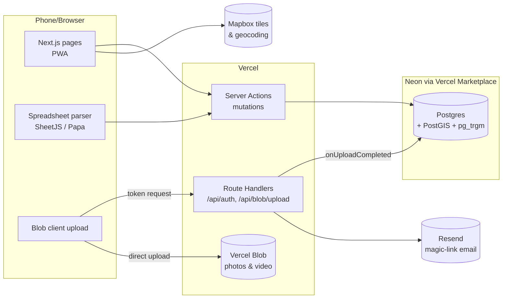

# Taste Buds: Build Plan
Owner: Pete · Status: Draft · Date: 2026-09-25 · Implements: [`taste-buds-prd.md`](taste-buds-prd.md)

This plan turns the PRD into a buildable sequence. Every PRD requirement (R1–R9) maps to a phase, and each phase ends with something the club can use. The backend runs entirely on Vercel.

---

## 1. Stack at a glance

| Layer | Choice | Why |
|---|---|---|
| Framework | **Next.js (App Router) + TypeScript** | Vercel's native framework. One codebase handles UI, server actions, and API routes |
| Hosting / backend | **Vercel** (Hobby plan) | Serverless functions, preview deploy per branch, env management. Hobby covers non-commercial personal projects |
| Database | **Postgres via Neon, installed from the Vercel Marketplace** | This is Vercel's Postgres offering. Env vars are injected automatically, and each preview deploy gets its own DB branch |
| ORM / migrations | **Drizzle ORM + drizzle-kit** | Typed schema in TS, plain SQL migrations, lightweight on serverless |
| Geo | **PostGIS** extension on Neon | `ST_DWithin` for "near me" (R9) and map-viewport queries (R4) |
| Fuzzy matching | **pg_trgm** extension | Matches messy spreadsheet names to catalog root beers (R2) |
| File storage | **Vercel Blob** | Photos and video (R3). Browser uploads go straight to Blob, so large videos don't pass through a function |
| Auth | **Auth.js (NextAuth v5)**: Google sign-in + email magic link via **Resend**, gated by an **invite allowlist** | Closed group of five, no passwords to manage, and accounts live in your own DB |
| Maps | **Mapbox GL JS** via `react-map-gl`, plus Mapbox Geocoding/Search | Map, clustering, and address search from one vendor, with a generous free tier |
| UI | **Tailwind CSS + shadcn/ui** | Fast, accessible components that work well on mobile |
| Validation | **Zod** | Shared schemas for forms, server actions, and import rows |
| Import parsing | **SheetJS (`xlsx`)** for .xlsx/.xls, **Papa Parse** for .csv | Parsing runs in the browser, so files never need to be stored |
| Photo metadata | **exifr** | Reads the capture date and GPS from phone photos (see the PRD open question) |
| Testing | **Vitest** (unit), **Playwright** (end-to-end) | Import logic is the riskiest code and gets the most tests |
| CI | **GitHub Actions** (lint, typecheck, test) + Vercel preview deploys | Every PR gets a live URL and its own database branch |

> **Mobile-first:** most logging happens with a root beer in hand. The app ships as a **PWA** (installable to the home screen, camera access via `<input type="file" accept="image/*,video/*" capture>`). No native app is needed for v1.

---

## 2. Architecture



**Principles**
- **Server actions handle all writes.** Each one validates input with Zod, checks the session, and scopes to `session.user.id`.
- **Reads are server components** that query Drizzle directly. No separate REST API is needed.
- **Media never passes through a function.** The browser gets a short-lived upload token from `/api/blob/upload`, uploads straight to Blob, and a completion callback writes the `media` row.
- **Everything is server-rendered** by default, with client components only where interaction needs them (map, rating slider, import wizard).

---

## 3. Data model

Everyone shares one **catalog** of root beers. Each member has a personal **log** of tastings. Locations and purchase links hang off the catalog.

```
users ─┬─< tastings >── root_beers ──< purchase_links
       │      │              │
       │      └──< media     ├──< location_root_beers >── locations
       ├─< favorites >───────┘
       └─< import_batches ──< tastings (source = import)
allowed_emails (invite list)
```

### Tables

**`users`**: Auth.js adapter tables (`users`, `accounts`, `sessions`, `verification_tokens`), plus `display_name` and `avatar_url` on `users`.

**`allowed_emails`**: `email (pk)`, `invited_by`, `created_at`. The sign-in callback rejects any email that isn't on this list. Seed it with the five members.

**`root_beers`** (shared catalog)
| column | type | notes |
|---|---|---|
| id | uuid pk | |
| slug | text unique | for URLs, e.g. `bundaberg-root-beer` |
| name | text | "Root Beer", "Old Fashioned" |
| brand | text | "Bundaberg" |
| maker / brewery | text null | |
| style | text null | e.g. craft, draft, diet, sarsaparilla, birch |
| sweetener | text null | cane sugar / HFCS / other (connoisseurs care) |
| origin | text null | region or country |
| image_url | text null | catalog hero image (Blob) |
| discontinued | bool default false | |
| search_key | text generated | normalized `brand + name`, **GIN trigram index** |
| created_by | uuid → users | |

**`tastings`** (the personal log, R3)
| column | type | notes |
|---|---|---|
| id | uuid pk | |
| user_id | uuid → users | |
| root_beer_id | uuid → root_beers | |
| rating | numeric(3,1) | **0.0–10.0**, CHECK constraint, 0.5 steps in the UI |
| notes | text | |
| tasted_on | date null | imports often lack dates |
| location_id | uuid null → locations | where they had it |
| purchased_from | text null | free text, e.g. "Total Wine", "online" |
| source | enum `manual` \| `import` | |
| import_batch_id | uuid null → import_batches | makes a batch undoable |
| created_at / updated_at | timestamptz | |
| **unique (user_id, root_beer_id)** | | one entry per person per root beer (see decision D2) |

**`media`**: `id`, `tasting_id → tastings (cascade)`, `blob_url`, `kind (image|video)`, `mime`, `bytes`, `width`, `height`, `duration_s`, `taken_at` (from EXIF), `sort_order`.

**`favorites`** (R7): `user_id`, `root_beer_id`, `created_at`, pk (user_id, root_beer_id). This is a separate table, so hunters can favorite root beers they haven't tried yet (a wishlist).

**`locations`** (R4)
| column | type | notes |
|---|---|---|
| id | uuid pk | |
| name | text | "Joe's Market" |
| address | text | |
| geom | geography(Point, 4326) | **GiST index** |
| mapbox_id / google_place_id | text null | deduplicates against search results |
| source | enum `seed_kml` \| `member` | |
| notes | text null | |
| created_by | uuid null → users | |

**`location_root_beers`** (what's actually on the shelf, which the community map doesn't show)
`location_id`, `root_beer_id`, `price_cents null`, `last_seen_on date`, `reported_by → users`, pk (location_id, root_beer_id).

**`purchase_links`** (R5)
`id`, `root_beer_id`, `retailer`, `url`, `price_cents`, `pack_size` (int), `unit_price_cents` (generated), `shipping_note`, `last_checked_on`, `added_by`.

**`import_batches`** (R2)
`id`, `user_id`, `filename`, `row_count`, `created_count`, `updated_count`, `skipped_count`, `changes jsonb` (previous values of any ratings the batch overwrote, used by undo), `status (committed|undone)`, `created_at`.

### Views
**`leaderboard_v`** (R8), per root beer:
- `avg_rating`, `rater_count`, `min_rating`, `max_rating`, `spread` (max − min)
- `ratings jsonb`: `[{user_id, display_name, rating}]` for side-by-side display

It's a plain view for now. At five users there's no need for materialization.

---

## 4. Key decisions (proposed, confirm or change)

| # | Decision | Recommendation | Why |
|---|---|---|---|
| D1 | Rating precision | `numeric(3,1)`, UI slider in **0.5** steps | Spreadsheets likely hold values like 7.5. A decimal is easy to round down later but hard to add after the fact |
| D2 | One entry or many per root beer? | **One entry per user per root beer**, editable (unique constraint) | Makes imports idempotent (upsert), makes "tasted / untasted" unambiguous, and keeps the leaderboard simple. Re-tastings can append to notes. Move to a history table later if the club wants it |
| D3 | Leaderboard disagreement (PRD open question) | Rank by **average**, show **each member's score as a chip**, and flag high **spread** as "Divisive" | Resolves the open question cheaply. The data is already visible within the club |
| D4 | Visibility | Your own log is the default view. Other members' ratings appear **only** on the leaderboard and on root beer detail pages. Only the owner can edit | Satisfies R1's "see only their own log by default" and still powers R8 |
| D5 | Catalog ownership | Any member can add or edit catalog entries and locations. A merge-duplicates tool comes in Phase 8 | Five trusted people, so no moderation queue is needed |
| D6 | Auth method | Google sign-in + email magic link, allowlist-gated | No passwords, works on phones |
| D7 | Map provider | Mapbox | Map + geocoding + clustering from one vendor. Google Maps is the alternative if you'd rather match the community map's look |

---

## 5. Build phases

Sizes: **S** ≈ an evening · **M** ≈ a weekend day · **L** ≈ a full weekend. Each phase is shippable on its own.

### Phase 0: Foundation (M)
- [ ] `create-next-app` with TypeScript, Tailwind, ESLint, App Router, `src/` layout. Add shadcn/ui
- [ ] **Vercel project:** import `palarkin/Taste-Buds`, production branch `main`, preview deploys on every PR
- [ ] **Neon via the Vercel Marketplace:** add the integration and enable **preview branching** (every PR deploy gets its own DB branch)
- [ ] Enable extensions in a first migration: `CREATE EXTENSION postgis; CREATE EXTENSION pg_trgm;`
- [ ] **Vercel Blob:** create a store and connect it to the project (injects `BLOB_READ_WRITE_TOKEN`)
- [ ] Drizzle config, `db` client (`@neondatabase/serverless` driver), `npm run db:generate` / `db:migrate`
- [ ] Run migrations in the Vercel build step (`drizzle-kit migrate && next build`) so previews and prod stay in sync
- [ ] GitHub Actions: lint, `tsc --noEmit`, Vitest on every PR
- [ ] App shell: bottom tab bar on mobile (**Log · Directory · Map · Leaderboard**), top nav on desktop
- [ ] PWA manifest + icons

**Done when:** a "hello" page is live on the production URL, and a PR shows a preview URL backed by its own DB branch.

### Phase 1: Accounts (S) → R1
- [ ] Auth.js v5 with the Drizzle adapter, Google provider, Resend email provider
- [ ] `signIn` callback checks `allowed_emails`. A non-invited user sees "This is a private club"
- [ ] Middleware protects everything except `/login`
- [ ] Profile page: display name and avatar
- [ ] Seed script adds the five members' emails

**Acceptance (R1):** a member can sign in and lands on their own empty log. A non-member is refused.

### Phase 2: Catalog + logging (L) → R3
- [ ] `root_beers` + `tastings` + `media` schema and migrations
- [ ] **Log a root beer** flow (mobile-first):
  1. Search the catalog as you type (trigram search on `search_key`), or **"Add new root beer"** inline (brand, name, optional style/sweetener)
  2. Rating slider 0–10 (0.5 steps, big touch target, the number shows live)
  3. Notes textarea
  4. **Add photo/video**: camera or library → client upload to Blob with a progress bar
  5. Optional: where you had it (location picker lands in Phase 5; free text until then)
- [ ] `/api/blob/upload` route handler: `handleUpload()` checks the session, restricts content types (`image/*`, `video/mp4`, `video/quicktime`), caps size (**images 15 MB, videos 150 MB / ~60 s**; tune later), and inserts a `media` row in `onUploadCompleted`
- [ ] Client-side: read EXIF `DateTimeOriginal` with exifr to pre-fill `tasted_on`, and downscale large images before upload
- [ ] **My Log** page: list/grid with thumbnail, rating badge, date. Sort by rating or date
- [ ] **Tasting detail/edit** page: edit rating and notes, add/remove/reorder media, delete the entry
- [ ] **Root beer detail** page (`/r/[slug]`): catalog info, your tasting, and (later) group ratings, where to buy, where to find it

**Acceptance (R3):** save an entry with a rating, notes, and one photo or video. Reopen it and edit it.

### Phase 3: Spreadsheet import (L) → R2
This is the riskiest feature and gates the PRD's only milestone ("all five migrate off spreadsheets"), so it comes early.

Import wizard at `/import`:
1. **Upload**: .xlsx, .xls, or .csv, parsed **in the browser** (SheetJS / Papa Parse). If there are multiple sheets, pick one.
2. **Map columns**: auto-detect headers by synonyms (e.g. *brand/maker/company*, *name/root beer/flavor*, *rating/score/stars*, *notes/comments*, *date/tasted*, *where/store/location*). The user confirms or overrides each mapping. Unmapped columns are appended to notes (optional).
3. **Normalize ratings**: detect the scale from the data (max ≤ 5 → "Looks like a 5-point scale, convert to 10?"). Handle "8/10", "4 stars", and blanks.
4. **Match root beers**: for each row, run a server action that does a trigram search against the catalog.
   - Similarity ≥ 0.8 → auto-match (shown, can be changed)
   - 0.4–0.8 → suggestions for the user to pick
   - otherwise → "Create new catalog entry"
   - Duplicates within the file collapse into one.
5. **Preview & conflicts**: a table of what will be *created / updated / skipped*. If you've already logged a root beer (from an earlier import or manual entry) and the rating differs, choose **keep existing / use spreadsheet** per row or for all.
6. **Commit**: one server action in one transaction creates the `import_batch`, upserts catalog entries, and upserts tastings with `source='import'`. Batches of about 500 rows keep each call well under function time limits.
7. **History**: `/import/history` lists past batches with counts and an **Undo batch** button. Undo deletes tastings created by that batch and restores ratings it overwrote (from the batch's `changes` column).

Tests: a Vitest suite for header detection, rating normalization, name normalization (strip "root beer", punctuation, case, "&" vs "and"), and conflict resolution, using **each member's real spreadsheet as a fixture** (collect them early).

**Acceptance (R2):** upload a spreadsheet and its rows appear in the log. A second, different spreadsheet imported later adds to the log without touching the first import.

### Phase 4: Directory, filters, favorites (M) → R5, R6, R7
- [ ] **Directory** (`/directory`): the full catalog with a search box
  - Filters: **Tasted / Untasted / All**, **My rating ≥ X**, **Favorites**, style, sweetener
  - Sort: **My rating high → low** (default when "Tasted" is on), group average, name, recently added
  - Filters live in URL search params, so views are shareable and bookmarkable
- [ ] **Favorite** toggle (heart) on cards and detail pages. Favorites are visibly marked and available as a filter
- [ ] **Where to buy online** section on the root beer detail page:
  - list of `purchase_links`: retailer, pack size, price, **price per bottle**, shipping note, "last checked" date, **Buy →** outbound link (`target=_blank rel="noopener noreferrer"`)
  - "Add a link" form (retailer, URL, price, pack size). Prices are member-entered. No scraping in v1
  - Directory filter/sort: **Available online**, **cheapest per bottle**

**Acceptance:** R5 (each root beer can show at least one purchase link with a price), R6 (untasted-only view, and tasted list sorted high → low), R7 (favorites are marked and filterable).

### Phase 5: Map (L) → R4
- [ ] **Seed from the community Google Map:** export it as KML (My Maps → ⋮ → *Export to KML/KMZ*; this needs the map owner to allow it, so ask them first). Parse it with `@tmcw/togeojson` in a one-off script → `locations` (`source='seed_kml'`). Parse pin descriptions for brand mentions where possible, and flag them for review
- [ ] **Map page** (`/map`) with Mapbox GL via `react-map-gl`:
  - Loads pins for the current viewport (server query with `ST_Intersects` on the bounding box, debounced on pan/zoom)
  - **Clustering** for dense areas
  - **Pin color encodes your status**: 🟢 *has something you haven't tried* · ⚪ *everything tried* · ⚫ *unknown stock*. This fixes the PRD's core pain of opening pins blind
  - Filter chips: *Has untasted*, *Has a favorite*, specific root beer ("where can I find X?")
- [ ] **Pin sheet** (bottom drawer on mobile): location name, address, directions link (opens Apple/Google Maps), and the **list of root beers there**, each marked tasted ✓ / untasted, with the price if known and "last seen" date
- [ ] **Add / update** a location: Mapbox Search autocomplete → create the location. **"I saw this here"** adds a root beer to a location and sets `last_seen_on = today`
- [ ] Logging a tasting can pick a location, which updates `location_root_beers` automatically
- [ ] Root beer detail page: **"Where to find it"** mini-map

**Acceptance (R4):** tapping a pin shows the specific root beers available there.

### Phase 6: Leaderboard (M) → R8
- [ ] `leaderboard_v` view (§3)
- [ ] **Leaderboard page** (`/leaderboard`):
  - Ranked by **average rating**, with a minimum-raters filter (e.g. "rated by ≥ 3 members") so one 10/10 doesn't top the chart
  - Each row shows the average, number of raters, **per-member chips** (avatar + score), and a **Divisive** badge when spread ≥ 4
  - Filters: min raters, style, sweetener, **"Untasted by me"** (the group loves it but you haven't tried it yet, which is great for hunters), favorites
  - Sorts: average, most rated, most divisive
- [ ] Root beer detail page: group ratings section

**Acceptance (R8):** root beers are ranked by average rating across members, and the view can be filtered.

### Phase 7: Nearby (S–M) → R9 (Should)
- [ ] **"What's around me"** button on the Map and a `/nearby` list view
- [ ] Browser Geolocation API (permission prompt, handles denial gracefully with "Search an area instead")
- [ ] Server action: `ST_DWithin(geom, point, radius)` ordered by `ST_Distance`. Radius presets 5 / 25 / 100 mi
- [ ] Results list: distance, location, count of **untasted** root beers there. Tap to open on the map

**Acceptance (R9):** "What's around me" returns nearby locations based on your current position.

### Phase 8: Polish & migration day (M)
- [ ] **Migration day:** each member imports their spreadsheet(s) with you on hand to fix mapping issues. This is the PRD's success milestone
- [ ] **Catalog merge tool:** pick two duplicate entries → merge into one (re-points tastings, media, links, and locations; resolves the unique-constraint conflict by keeping the newer rating)
- [ ] Empty states, loading skeletons, error boundaries, toasts
- [ ] Accessibility pass (keyboard, labels, contrast) and a Lighthouse/PWA check
- [ ] Basic monitoring: Vercel Analytics + Speed Insights (both have a free tier)
- [ ] **Backups:** Neon point-in-time restore (confirm the retention on your plan) + a weekly GitHub Action that runs `pg_dump` to a private artifact

### Stretch: Photo back-fill (PRD open question)
"I rated it on video but never logged it":
- [ ] **Bulk media import** at `/import/photos`: select many photos/videos → read EXIF date + GPS client-side → group by day/place → for each group, "Which root beer is this?" (catalog search) + a quick rating → creates tastings with media attached
- [ ] GPS can suggest the nearest known location

---

## 6. Project structure

```
src/
  app/
    (auth)/login/page.tsx
    (app)/
      layout.tsx                 # tab bar, session guard
      log/page.tsx               # My Log
      log/new/page.tsx
      log/[id]/page.tsx          # tasting detail/edit
      r/[slug]/page.tsx          # root beer detail
      directory/page.tsx
      map/page.tsx
      nearby/page.tsx
      leaderboard/page.tsx
      import/page.tsx            # wizard
      import/history/page.tsx
      settings/page.tsx
    api/
      auth/[...nextauth]/route.ts
      blob/upload/route.ts
  actions/                       # server actions, one file per domain
    tastings.ts  catalog.ts  favorites.ts  locations.ts  links.ts  import.ts
  db/
    schema.ts                    # Drizzle tables, enums, relations
    views.ts                     # leaderboard_v
    index.ts                     # neon client
  lib/
    auth.ts                      # Auth.js config + allowlist
    import/                      # headers.ts, ratings.ts, normalize.ts, match.ts (pure, unit-tested)
    geo.ts                       # PostGIS query helpers
    validation.ts                # Zod schemas
  components/
    rating-slider.tsx  media-uploader.tsx  root-beer-card.tsx  map/*  ui/* (shadcn)
drizzle/                         # generated SQL migrations
scripts/
  seed-members.ts
  seed-locations-from-kml.ts
tests/
  unit/  e2e/  fixtures/spreadsheets/
```

---

## 7. Environment & configuration

| Variable | Source |
|---|---|
| `DATABASE_URL`, `DATABASE_URL_UNPOOLED` | Injected by the Neon integration (per environment/branch) |
| `BLOB_READ_WRITE_TOKEN` | Injected when the Blob store is connected |
| `AUTH_SECRET` | `npx auth secret` → Vercel env |
| `AUTH_GOOGLE_ID`, `AUTH_GOOGLE_SECRET` | Google Cloud OAuth client (add prod + preview callback URLs) |
| `AUTH_RESEND_KEY`, `EMAIL_FROM` | Resend (verify a sending domain, or use Resend's test domain initially) |
| `NEXT_PUBLIC_MAPBOX_TOKEN` | Mapbox. **URL-restricted** to your Vercel domains |

Local development: `vercel link` then `vercel env pull .env.local` to pull the same variables, pointing at a Neon dev branch.

---

## 8. Security & privacy
- **Allowlist-only sign-in.** Every server action re-checks the session. Every write is scoped to `session.user.id`, and editing another member's tasting is rejected server-side, not just hidden in the UI.
- **Blob uploads:** token issuance requires a session, with content-type and size limits enforced in `handleUpload`. Blob URLs are unguessable but public. That's acceptable for tasting photos. If the club wants them private, switch to signed or proxied delivery later.
- **Location data:** the device's live location is used only for the "near me" query and is never stored. Strip GPS EXIF from uploaded images unless the user opts to keep it.
- **Outbound links** use `rel="noopener noreferrer"`. Stored URLs are validated as http(s).
- Mapbox token is domain-restricted. No secrets carry the `NEXT_PUBLIC_` prefix except the Mapbox token.

---

## 9. Cost (expected: $0/month)
For five users, everything should fit on free tiers: Vercel Hobby (non-commercial), Neon free, Vercel Blob's included storage, Mapbox free map loads, and Resend's free email tier. **Video is the one thing that can outgrow a free tier.** The upload caps in Phase 2 and client-side image downscaling are the main controls. Check each vendor's current free-tier limits during Phase 0, and set a Vercel spend alert.

Note: affiliate links (a PRD future direction) would make the project commercial. That would require Vercel Pro and a review of the other vendors' terms.

---

## 10. Testing strategy
| Level | Tool | Covers |
|---|---|---|
| Unit | Vitest | import header detection, rating normalization, name normalization, match thresholds, conflict resolution, price-per-unit math |
| Integration | Vitest + a Neon test branch | server actions: auth scoping, upserts, batch undo, leaderboard view math, PostGIS radius query |
| End-to-end | Playwright (against preview deploys) | sign in (test user on the allowlist) → log with photo → import fixture sheet → filter directory → favorite → leaderboard → map pin sheet |
| Manual | Phones | camera capture on iOS Safari + Android Chrome, PWA install, geolocation prompt |

---

## 11. Requirement traceability

| PRD req | Priority | Phase | Acceptance check |
|---|---|---|---|
| R1 Individual accounts | Must | 1 | Sign in, see own log only; non-members refused |
| R2 Spreadsheet import | Must | 3 | Upload → rows in log; later imports add without re-importing |
| R3 Logging | Must | 2 | Rating + notes + photo/video saved, editable |
| R4 Map with specific brands | Must | 5 | Pin shows specific root beers there |
| R5 Online purchase directory | Must | 4 | Entry has an outbound link + expected price |
| R6 Filter & sort | Must | 4 | Untasted-only view; tasted sorted high → low |
| R7 Favorites | Must | 4 | Marked and filterable |
| R8 Leaderboard | Must | 6 | Ranked by average across members, filterable |
| R9 Nearby | Should | 7 | "Around me" from live location |
| Open Q: photo back-fill | – | Stretch | Bulk EXIF-grouped import |
| Open Q: rating disagreement | – | 6 (D3) | Average + per-member chips + Divisive badge |
| Roadmap: crowdsourced stock | Won't (v1) | – | Partly laid down: `last_seen_on` + "I saw this here" provide the data shape to build on |

---

## 12. Risks & mitigations
| Risk | Mitigation |
|---|---|
| Spreadsheets are messier than expected (merged cells, multiple tabs, mixed scales) | Collect all five sheets in Phase 0 as test fixtures. The wizard lets the user override every guess. Batch undo makes mistakes cheap |
| Duplicate catalog entries ("A&W" vs "A & W Root Beer") | Trigram matching at every entry point, normalized `search_key`, and the merge tool in Phase 8 |
| Community map KML can't be exported, or the owner objects | Ask the owner first. Fallback: members add their go-to spots manually. Five people's local knowledge covers most of it |
| Map data goes stale | `last_seen_on` shown on every pin item, and "I saw this here" is one tap. Full crowdsourced verification stays on the roadmap |
| Video storage costs | Size/duration caps and a per-user storage display in settings |
| Serverless time limits on big imports | Chunked commits (~500 rows) and parsing done in the browser |

---

## 13. Suggested order of work, at a glance
1. **Phase 0–1**: live, sign-in-gated shell on Vercel
2. **Phase 2**: log root beers with photos *(usable from here on)*
3. **Phase 3**: import spreadsheets *(the migration milestone becomes possible)*
4. **Phase 4**: directory, filters, favorites, buy links
5. **Phase 5**: the better map
6. **Phase 6**: leaderboard
7. **Phase 7**: nearby
8. **Phase 8**: polish, migration day, backups

Phases 4, 5, and 6 are independent of one another once Phase 3 is done, so they can be reordered based on what the club is most excited about.
